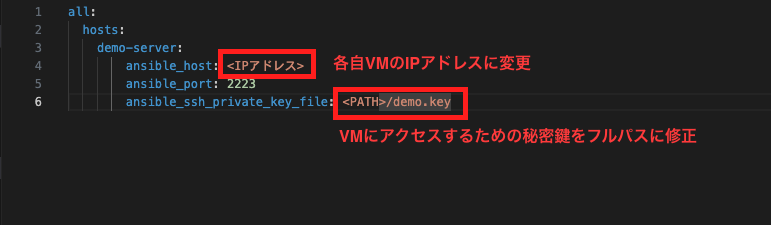
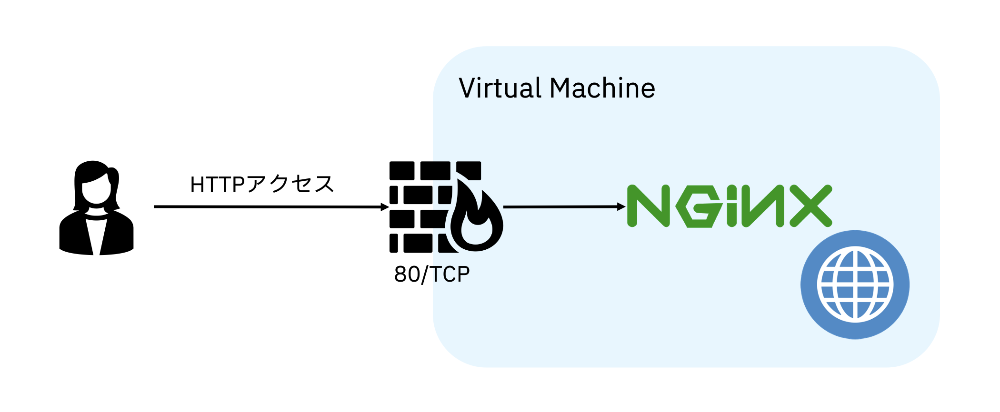
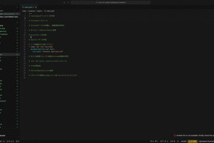
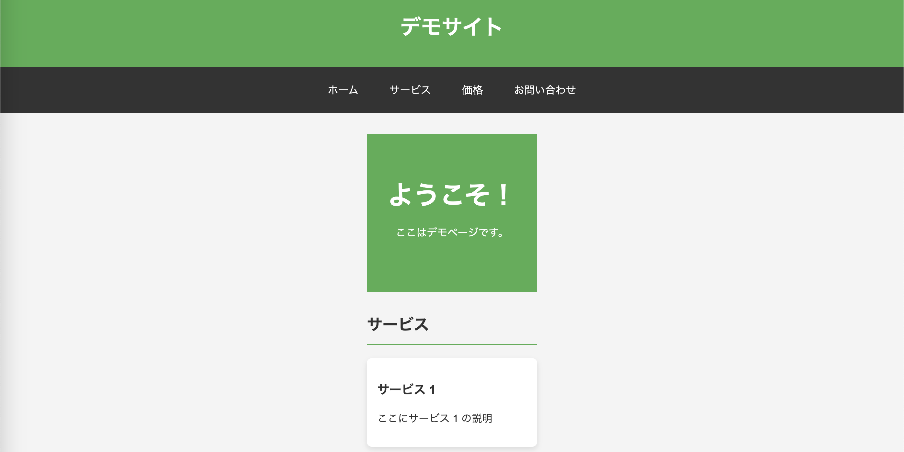

# 事前準備

## IPの書き換え
`inventories/handson/hosts.yaml`ファイルの下記の部分を修正して下さい。  


## pipenvを利用している場合(Option)
下記コマンドで必要なライブラリをインストールして下さい。  
```bash
pipenv install
```

# ディレクトリ構成
AnsibleのBest Practiceである[Alternative Directory Layout](https://docs.ansible.com/ansible/2.9/user_guide/playbooks_best_practices.html#alternative-directory-layout)を踏襲しています。  
```bash
├── handson.yaml
├── inventories
│   └── handson
│       ├── group_vars
│       │   └── all.yaml
│       ├── host_vars
│       │   └── handson-server.yaml
│       └── hosts.yaml
└── roles
    ├── common
    ├── deploy_app
    ├── firewalld
    ├── locale
    ├── memcached
    ├── nginx
    └── tomcat
```
inventories: hostsやPlaybook内で利用する変数等を定義  
roles: Taskをグループ化した値  
handson.yaml: 実行するPlaybook  

# 構築するサーバーのイメージ


# 進め方
`handson.yaml`の`roles`フィールドに定義されている順番に生成していきます。  
生成が完了した箇所からコメントアウトを外して下さい。
```yaml
  roles:
  # - common
  # - nginx
  # - firewalld
```
定義されている`role`と実態のファイルは`roles/<Role名>/tasks/main.yaml`になります。  
例）`common`の場合は`roles/common/tasks/main.yaml`になります。  
必要なTemplateやFileについては事前に定義しております。  

## 生成方法
`main.yaml`に記載のあるコメントアウトされている部分を`name`フィールドに定義して下さい。  


## 注意点
一部`main.yaml`に`set_fact`モジュールが事前に定義されています。  
```yaml
- name: Set fact hostname
  ansible.builtin.set_fact:
    hostname: "handson.ibmcloud.com"
```
こちらは、ハンズオン用に生成をスムーズにするために予め定義しております。  
本来であれば変数定義は別ファイルで定義されると思いますが、その場合ファイルを跨いで変数名は参照し生成できないため今回はこのような形を取らせて頂いてます。  

pipenvを利用している場合  
```bash
pipenv run start
```

# 確認
全てのRoleを実行後に下記のURLにアクセスして画面が表示されることを確認して下さい。  
http://<VMのIPアドレス>/root/home  

